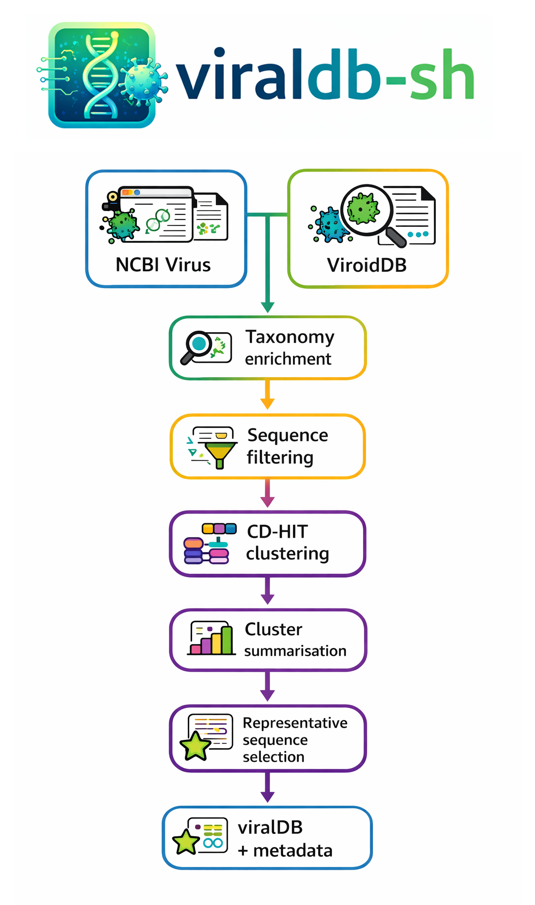

<p align="center">
  
</p>

<h1 align="center">Plant Virus and Viroid Database</h1>

<h3 align="center">
A lightweight pipeline for building a curated plant viral database from NCBI Virus and ViroidDB
</h3>

<p align="center">
  
  
  
  
</p>

**viraldb-sh v0.1** is a lightweight, Bash-based pipeline for building a curated viral database
from **NCBI Virus (GenBank + RefSeq)** and **ViroidDB**, with taxonomy enrichment, sequence 
filtering, clustering, and representative selection.

The pipeline is intentionally lightweight and transparent, designed for HPC environments and 
long-term maintainability.

---

## Key features

The pipeline is designed to be:
- ✅ **Simple & transparent** — pure Bash orchestrating Python tools
- ✅ **HPC-safe** — runs on PBS Pro, SLURM, or locally
- ✅ **Reproducible** — version stamping, manifests, checksums
- ✅ **Fail-fast** — validation mode catches problems early
- ✅ **Safe to test** — dry-run mode prints commands without executing


## Pipeline Overview

The pipeline performs the following steps:

1. **Download viral sequences**
   - NCBI Virus (GenBank + RefSeq)
   - ViroidDB

2. **Enrich FASTA headers**
   - Adds taxonomic linease from NCBI Datasets JSONL

3. **Merge, filter, and sort sequences per species**
   - Remove short sequences (e.g. length < 200 bp)
   - Filter sequences with excessive Ns (e.g., Ns fraction > 3% of bases in sequence)

4. **Cluster sequences (CD-HIT-EST)**
   - Identity thresholds: `1.0`, `0.995`, `0.99`

5. **Summarise clusters**
   - Detect and report mixed-species clusters

6. **Phase 2 representative selection**
   - Policy-based representative selection
   - Criteria: majority seqs in cluster's annotation -> RefSeq curated -> complete genome / segment -> strain -> longest 

7. **Generate checksums & manifest**
   - For reproducibility and auditing


<p align="center">
  
</p>


## Repository structure

```text
viraldb-sh/
├── assets
│   ├── pipeline_overview.png
│   └── viraldb-sh_logo.png
├── bin                                # Python scripts
├── CHANGELOG.md
├── config
│   ├── config_viralDB.txt             # User-editable configuration
│   └── plant_virus_families.tsv
├── envs
│   └── viraldb.yaml                   # Conda environment definition
├── examples
│   └── config_viralDB_example.txt
├── launch_viralDB_download_v0.1.pbs
├── launch_viralDB_download_v0.1.sh
├── launch_viralDB_download_v0.1.slurm
├── lib                                
│   └── pipeline_utils.sh              # Shared Bash utilities
├── LICENSE
└── README.md
```
## Requirements

#### Software:
- Bash ≥ 4
- Conda / Mamba
- Python ≥ 3.9
- NCBI Datasets CLI (datasets)
- CD-HIT (cd-hit-est)

All runtime tools are expected to be available via a Conda environment.

## Installation

1. **Clone the repository**
```bash
git clone https://github.com/robertobarrero/viraldb-sh.git
cd viraldb-sh
```
2. **Create the Conda environment**
```bash
conda env create -f envs/viraldb.yaml
```
or (recommended)
```bash
mamba env create -f envs/viraldb.yaml
```
## Configuration
Edit the main configuration file
```bash
config_viralDB.txt
```
### Key variables:
```bash
PIPELINE_NAME="viraldb-sh"
PIPELINE_VERSION="0.1"

CONDAENV="viralDB"

BIN_DIR="${PIPELINE_DIR}/bin"
#VIRAL_FAMILIES_TSV="/path/to/plant_virus_families.tsv"
VIRAL_FAMILIES_TSV="${BIN_DIR}/plant_virus_families.tsv"

CPUS=4
MIN_LEN=200
MAX_NS_FRACTION=3.0

CDHIT_MEM_MB=8192        # Memory passed to cd-hit-est (-M, in MB)
PHASE2_POLICY="majority"
REFSEQ_MIN_LEN_FRAC=0.90
```
## Running the pipeline
#### Local / interactive HPC session
```bash
bash launch_viralDB_download.sh
```
#### PBS Pro
```bash
qsub launch_viralDB_download.pbs
```
#### SLURM
```bash
sbatch launch_viralDB_download.slurm
```
The pipeline automatically detects:
- PBS_O_WORKDIR
- SLURM_SUBMIT_DIR
- or defaults to the current directory

All outputs and logs are created in the **run directory**.

## Validation mode (recommended first step prior running the pipeline)
Validation checks:
- Required executables on PATH
- Writable output directories
- Presence of all required input files
- Presence of pipeline scripts

Run validation only:
```bash
bash launch_viralDB_download.sh --validate
```
## Dry-run (safe preview)
Dry-run mode prints all commands without executing them:
```bash
bash launch_viralDB_download.sh --dry-run
```
Useful for:
- Reviewing commands
- Debugging paths
- Testing configuration changes

## Logging
Logs are writtenn to:
```bash
logs/viraldb_<DATE>.log
```
Notes:
- Logs are not written during dry-run (clean output).
- Each run has a unique timestamped log.

## Reproducibility and auditing
When **not** in dry-run mode, the pipeline automatically:
- Creates a run manifest
- Records:
  • Pipeline version
  • Tool versions
  • Configuration snapshot
  • Generates checksums (sha256) for key outputs

- This enables:
  • Provenance tracking
  • Long-term reproducibility
  • Exact re-runs using the same configuration

## Supported runtime modes
```bash
FEATURE                     DEFAULT
--dry-run                   off
--validate                  off
Manifest + checksums        automatic
```

## Phase 2 representative selection 
Representative sequences are selected per CD-HIT cluster (e.g., identity >=99.5%) using a policy-driven, hierarchical decision process using five criteria:
1.	**Majority annotation**
	-	Determine the dominant taxonomic annotation within the cluster
	-	Representatives are chosen from the majority group
2.	**Reference database preference**
	-	Prefer RefSeq-curated sequences over GenBank-only records
3.	**Sequence completeness**
	-	Prefer complete genomes or complete segments over partial sequences
4.	**Sequence type specificity**
	-	Prefer strain-level or isolate-level annotations when available
5.	**Length-based tie-breaker**
	-	If multiple candidates remain, select the longest sequence

This ensures representatives are:
-	Taxonomically consistent
-	Curated where possible
-	Biologically complete
-	Maximally informative

## Example output
```text
├── 20260302_viralDB_representatives__all__c0.990000.fasta
├── 20260302_viralDB_representatives__all__c0.995000.fasta
├── 20260302_viralDB_representatives__all__c1.000000.fasta
├── 20260302_viralDB_summary__all__c0.990000.tsv
├── 20260302_viralDB_summary__all__c0.995000.tsv
├── 20260302_viralDB_summary__all__c1.000000.tsv
├── clusters_c1000.tsv
├── clusters_c990.tsv
├── clusters_c995.tsv
├── clusters_mixed_species_members_c1000.tsv
├── clusters_mixed_species_members_c990.tsv
├── clusters_mixed_species_members_c995.tsv
├── clusters_summary_c1000.tsv
├── clusters_summary_c990.tsv
├── clusters_summary_c995.tsv
├── families
├── logs
├── manifest
├── ncbi_viral__ALL_FAMILIES.data_report.jsonl
├── ncbi_viral__ALL_FAMILIES.fasta
├── ncbi_viral__ALL_FAMILIES__taxonomy.fasta
├── ncbi_viral__ALL_FAMILIES__taxonomy_metadata.tsv
├── ncbi_viral_unclassifiedViroids__ALL_FAMILIES__taxonomy.fasta
├── ncbi_viral_unclassifiedViroids__ALL_FAMILIES__taxonomy_filtered.fasta
├── removed_Ns.tsv
├── removed_short.tsv
├── reps_all
├── unclassified.fasta
├── unclassified_viroids_taxonomy.fasta
├── unclassified_viroids_taxonomy_metadata.tsv
├── viroiddb_2021-06-06_src
├── viroiddb_2021-06-06.zip
└── viroiddb.fasta

6 directories, 28 files
```
### Pipeline philosophy
This pipeline intentionally avoids heavy workflow engines to:
- Reduce cognitive overhead
- Keep execution transparent
- Match HPC usage patterns
- Enable easy debugging and maintenance

It can be run:
- Interactively
- As a batch job
- Inside larger meta-workflows if needed

### Author
**Roberto A. Barrero**
eResearch, Research Infrastructure, Academic Division,
Queensland University of Technology (QUT), Australia

## Citation

If you use **viraldb-sh** in your research please cite:

Barrero R.A. *viraldb-sh: A lightweight pipeline for building curated viral databases from NCBI Virus and ViroidDB.*

## License

This project is licensed under the **MIT License**.

See the [LICENSE](LICENSE) file for details.
